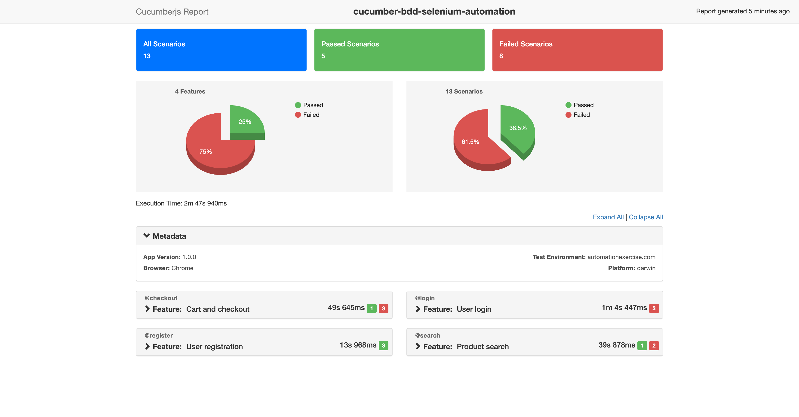

# Cucumber BDD Automation Framework (JavaScript + Selenium)

A professional QA automation framework built with **JavaScript**, **Selenium WebDriver**, and **Cucumber (BDD)** for the [Automation Exercise](https://automationexercise.com) practice site. Designed to demonstrate scalable automation architecture, Page Object Model, and CI/CD-ready structure for portfolios and technical interviews.

---

## Project Overview

This framework automates real user flows on an e-commerce practice website: login, registration, product search, cart actions, and checkout. It showcases:

- **BDD** with Gherkin feature files and reusable step definitions  
- **Page Object Model (POM)** for maintainable, readable tests  
- **Stable execution** via explicit waits and robust locators  
- **HTML reporting** for test results  
- **CI/CD readiness** (headless runs, configurable browser, env-based options)

---

## Framework Architecture

```
project-root
│
├── features/                 # Gherkin feature files
│   ├── login.feature
│   ├── register.feature
│   ├── search.feature
│   └── checkout.feature
│
├── step-definitions/         # Cucumber step definitions
│   ├── commonSteps.js       # Shared steps (e.g. navigate to login, home)
│   ├── loginSteps.js
│   ├── registerSteps.js
│   ├── searchSteps.js
│   └── checkoutSteps.js
│
├── pages/                    # Page Object Model
│   ├── BasePage.js           # Shared WebDriver helpers & waits
│   ├── HomePage.js
│   ├── LoginPage.js
│   ├── ProductPage.js
│   ├── CartPage.js
│   └── CheckoutPage.js
│
├── support/                  # Framework support
│   ├── hooks.js              # Before/After hooks, screenshots on failure
│   ├── world.js              # Custom World (driver + page instances)
│   ├── driver.js             # WebDriver creation (Chrome/Firefox, headless)
│   └── generateReport.js     # HTML report from JSON
│
├── config/
│   └── cucumber.js           # Cucumber configuration
│
├── reports/                  # Test outputs
│   ├── cucumber-report.json
│   ├── cucumber-report.html  # Generated by cucumber-html-reporter
│   └── screenshots/          # Failure screenshots
│
├── package.json
└── README.md
```

---

## Tools Used

| Tool | Purpose |
|------|--------|
| **Node.js** | Runtime |
| **JavaScript** | Language |
| **Selenium WebDriver** | Browser automation |
| **Cucumber.js** | BDD framework, Gherkin parsing |
| **Chai** | Assertions |
| **cucumber-html-reporter** | HTML test reports |


## Running Tests

| Command | Description |
|--------|-------------|
| `npm run test` | Run all scenarios (headless Chrome, default) |
| `npm run test:report` | Run tests and generate HTML report |
| `npm run test:headed` | Run with browser window visible |
| `npm run test:chrome` | Force Chrome |
| `npm run test:firefox` | Force Firefox |
| `npm run report` | Generate HTML report from existing `reports/cucumber-report.json` |

**Examples:**

```bash
npm run test
npm run test:report
BROWSER_HEADLESS=false npm run test
```

---

## Test Scenarios Covered

### Login (`features/login.feature`)
- Successful login and redirect
- “Logged in as” visible in header
- Invalid credentials show error message
- Logout and redirect to login page

### Registration (`features/register.feature`)
- New user signup (name + email) and redirect to signup flow
- Signup form and login form visibility (required fields / UI validation)

### Search (`features/search.feature`)
- Search from home and from products page
- Search results contain products and match search term

### Cart & Checkout (`features/checkout.feature`)
- Add first product to cart from home, open cart via modal
- Cart contains at least one item
- Remove item and assert cart empty
- Proceed to checkout and validate order summary and delivery address

---

## Reporting

- **JSON:** `reports/cucumber-report.json` (generated on every run with default config).
- **HTML:** Run `npm run test:report` or `npm run report` after tests to generate `reports/cucumber-report.html` with **cucumber-html-reporter** (Bootstrap theme, scenario-level details, metadata).

### Example report section (screenshot placeholder)

After running `npm run test:report`, open `reports/cucumber-report.html` in a browser. You can add a screenshot here for your portfolio:

## Test Execution Report

<p align="center">
  
</p>

---


## BDD Approach

- **Feature files** describe behavior in Gherkin (`Feature`, `Scenario`, `Given`/`When`/`Then`).
- **Step definitions** map steps to code (page objects and assertions).
- **Shared steps** (e.g. “the user is on the home page”) are defined once and reused across features.

This keeps tests readable for non-technical stakeholders and aligns automation with acceptance criteria.

---

## CI/CD Readiness

- **Headless by default** for CI (e.g. GitHub Actions, Jenkins).
- **Browser and headless** configurable via env: `BROWSER`, `BROWSER_HEADLESS`.
- **Structured reports:** JSON for pipelines; HTML for review.
- **Failure screenshots** saved under `reports/screenshots/` and attached in Cucumber report when a scenario fails.

---

## License

MIT.
